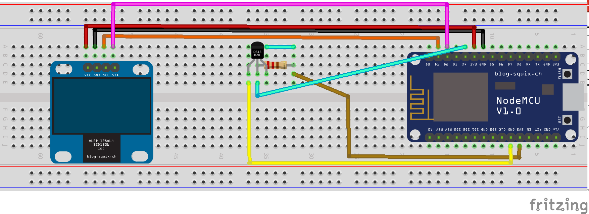

# thermoclock
Clock and thermometer using NodeMcu and arduino esp8266 libraries

Uses 
* NTP library https://github.com/arduino-libraries/NTPClient
* Wifi manager captive portal https://github.com/tzapu/WiFiManager
* ESP8266 Oled Driver for SSD1306
* OneWire https://www.pjrc.com/teensy/td_libs_OneWire.html
* Dallas Temperature https://github.com/milesburton/Arduino-Temperature-Control-Library

#### Building the circuit
Example layout for the circuit is below. Use a USB A to micro B cable for power and any programming.

Display&emsp;&emsp;&emsp;NodeMCU

SCL&nbsp;&nbsp;&nbsp;D1
SDA&nbsp;&nbsp;&nbsp;D2

DS18B20&nbsp;&nbsp;&nbsp;NodeMCU
1&nbsp;&nbsp;&nbsp;GND

2&nbsp;&nbsp;&nbsp;D4

3&nbsp;&nbsp;&nbsp;3V3
#### Connecting to WiFi ####
The clock uses wifi to get accurate time from the internet. To connect to your WiFi network, connect to the "Thermoclock" WiFi station on a mobile phone. Enter your wifi ID and password in the web page that is displayed when you open a browser so the clock has access.
#### Compiling the program
Add the ESP8266 Oled Driver for SSD1306 by Daniel Eichorn, Fabrice Weinberg Version 3.2.5

#### Burning the program to the NodeMCU
Tested using Arduino 1.8.1 IDE https://www.arduino.cc/en/Main/Software
* Load the sketch (thermoclock.ino file) into the IDE
Board: "NodeMCU 0.9 ( ESP12 Module)"
If this board is not in the list in "Tools/Boards" in the IDE, need to grab some more bits. 
* Go to File/Preferences and type the following in "Additional Boards Manager URLs" http://arduino.esp8266.com/stable/package_esp8266com_index.json, then press OK. 
* Now go to Tools/Boards/Board Manager and search for "ESP8266"
* Select "ESP8266 by ESP8266 Community", then install.
 
Adding the libraries:

Sketch/Include Library/Manage Libraries/Search for OneWire then install

Sketch/Include Library/Manage Libraries/Search for DallasTemperature then install

Sketch/Include Library/Manage Libraries/Search for SSD1306 then install ESP8266 Oled Driver for SSD1306 display

Sketch/Include Library/Manage Libraries/Search for WifiManager then install

Sketch/Include Library/Manage Libraries/Search for NTPClient then install NTPClient by fabrice Weinberg
